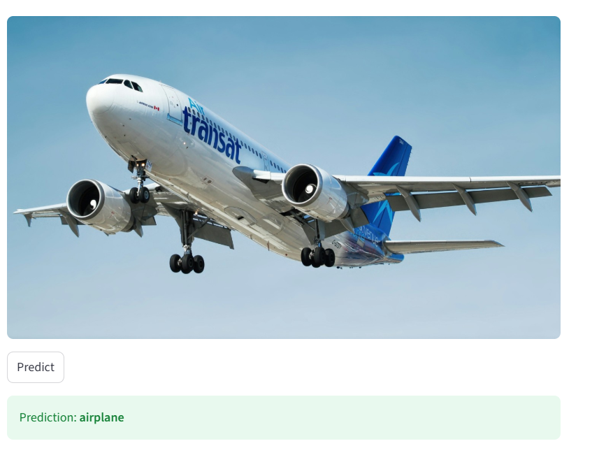
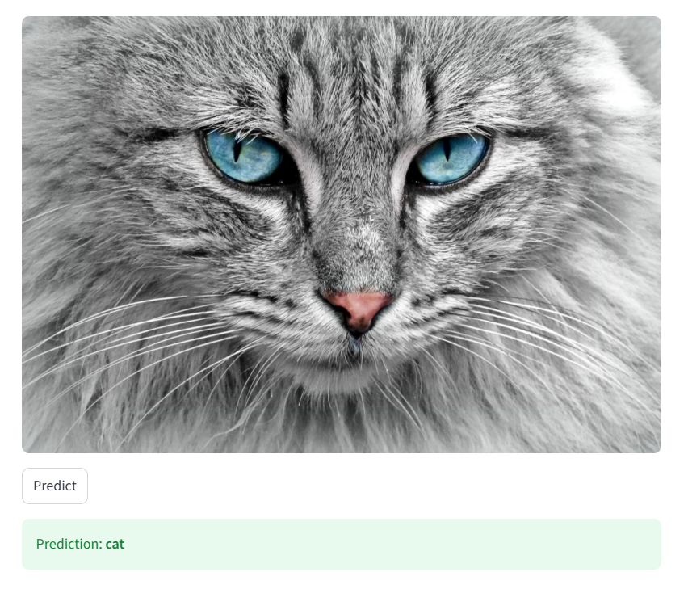
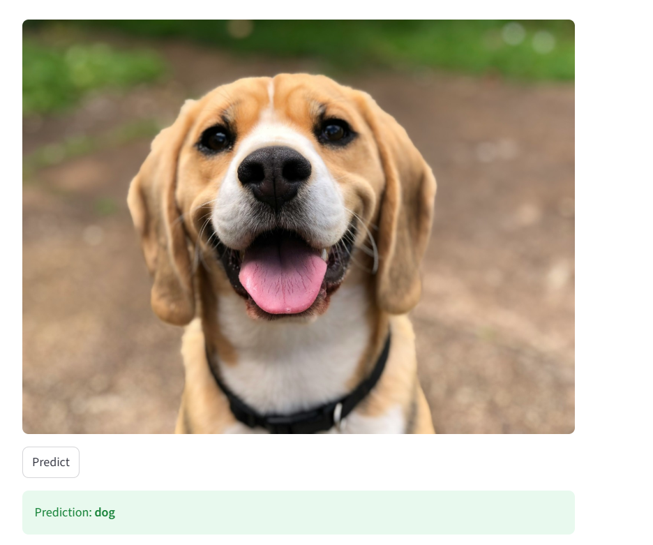

# 🧠 CIFAR-10 CNN Classifier


Implémentation d'un réseau de neurones convolutif (CNN) pour la classification d'images sur le dataset **CIFAR-10**, entraîné sur GPU avec PyTorch dans Google Colab et Kaggle. Inclut une application de démo interactive avec **Streamlit** et un déploiement **Dockerisé**.

---

## 🌐 Live Demo

[](https://animal-classification-2gd59hwka4ppwvsjsnp7cp.streamlit.app/)

> 🚀 **[Accéder à l'application déployée](https://animal-classification-2gd59hwka4ppwvsjsnp7cp.streamlit.app/)** — Testez le modèle directement dans votre navigateur, sans installation.

---

## 🖼️ Demo — Streamlit App

The interactive Streamlit app lets you upload any image and instantly get a prediction from the trained CNN model. Below are real inference examples across three different CIFAR-10 classes:

| ✈️ Airplane | 🐱 Cat | 🐶 Dog |
|:-----------:|:------:|:------:|
|  |  |  |
| **Input:** Air Transat Airbus A310 | **Input:** Grey fluffy cat close-up | **Input:** Beagle portrait |
| ✅ **Prediction: airplane** | ✅ **Prediction: cat** | ✅ **Prediction: dog** |

> The model correctly classified all three images despite them being high-resolution real-world photos — very different from the 32×32 training data.

---

## 📊 Dataset


Le dataset CIFAR-10 contient 60 000 images couleur (32×32 px) réparties en 10 classes :

| Classe | Classe | Classe | Classe | Classe |
|--------|--------|--------|--------|--------|
| ✈️ airplane | 🚗 automobile | 🐦 bird | 🐱 cat | 🦌 deer |
| 🐶 dog | 🐸 frog | 🐴 horse | 🚢 ship | 🚚 truck |

- **Entraînement** : 50 000 images
- **Test** : 10 000 images

---

## 🏗️ Architecture

```
Input (3×32×32)
    │
    ▼
[Bloc 1] Conv2d(3→32, 3×3) → BatchNorm2d → ReLU → MaxPool(2×2)
    │                                               32×32 → 16×16
    ▼
[Bloc 2] Conv2d(32→64, 3×3) → BatchNorm2d → ReLU → MaxPool(2×2)
    │                                               16×16 → 8×8
    ▼
[Bloc 3] Conv2d(64→128, 3×3) → BatchNorm2d → ReLU → MaxPool(2×2)
    │                                               8×8 → 4×4
    ▼
Flatten → Dropout(0.4)
FC(128×4×4 → 256) → ReLU
FC(256 → 10)
    │
    ▼
Output (10 classes)
```

---

## ⚙️ Configuration d'entraînement

| Hyperparamètre | Valeur |
|----------------|--------|
| Optimiseur | Adam |
| Learning rate | 0.001 |
| Batch size | 128 |
| Epochs | 15 |
| Scheduler | StepLR (step_size=5, gamma=0.5) |
| Dropout | 0.4 |
| Normalisation | (0.5, 0.5, 0.5) / (0.5, 0.5, 0.5) |

---

## 🚀 Installation & Utilisation

### Prérequis

```bash
pip install torch torchvision matplotlib streamlit pillow numpy
```

### Lancer sur Google Colab

1. Ouvrir le notebook dans Google Colab
2. Activer le GPU : `Exécution → Modifier le type d'exécution → GPU (T4)`
3. Exécuter toutes les cellules dans l'ordre : `Ctrl + F9`

### Vérifier le GPU

```python
import torch
print(torch.cuda.is_available())        # True
print(torch.cuda.get_device_name(0))    # Tesla T4
```

### Lancer l'application Streamlit

Après avoir exécuté toutes les cellules du notebook (le fichier `model.pth` doit exister) :

```bash
streamlit run app.py
```

Ou directement via le déploiement en ligne : **https://animal-classification-2gd59hwka4ppwvsjsnp7cp.streamlit.app/**

### Structure du notebook

```
📓 cifar10_cnn.ipynb
├── 🔧 1.  Installation des dépendances
├── 📦 2.  Imports
├── 🗃️  3.  Chargement du dataset CIFAR-10
├── 🖼️  4.  Visualisation des données
├── 🧠 5.  Architecture du modèle CNN
├── 🚀 6.  Entraînement
├── 🔍 7.  Évaluation
├── 📈 8.  Courbe de loss
├── 💾 9.  Sauvegarde du modèle
├── 🔮 10. Fonction de prédiction
├── 🧪 11. Test sur une image
└── 🌐 12. Application Streamlit (app.py)
```

---

## 🐳 Docker

L'application est entièrement **dockerisée** — aucune installation Python requise sur votre machine.

### Prérequis

Installer [Docker Desktop](https://www.docker.com/products/docker-desktop)

### Structure des fichiers

```
cifar10-cnn/
├── app.py
├── model.pth
├── Dockerfile
└── requirements.txt
```

### Dockerfile

```dockerfile
FROM python:3.10-slim

WORKDIR /app

COPY requirements.txt .
RUN pip install --no-cache-dir -r requirements.txt

COPY app.py .
COPY model.pth .

EXPOSE 8501

CMD ["streamlit", "run", "app.py", \
     "--server.port=8501", \
     "--server.headless=true", \
     "--server.address=0.0.0.0"]
```

### Builder l'image

```bash
docker build -t cifar10-cnn .
```

### Lancer le conteneur

```bash
docker run -p 8501:8501 cifar10-cnn
```

Puis ouvrez **http://localhost:8501** dans votre navigateur. 🎉

### Vérifier l'image

```bash
docker images
```

```
REPOSITORY     TAG       IMAGE ID       CREATED         SIZE
cifar10-cnn    latest    1a2ad8b6d609   5 minutes ago   ~1.5GB
```

### Publier sur Docker Hub (optionnel)

```bash
# Se connecter
docker login

# Tagger l'image
docker tag cifar10-cnn votre-username/cifar10-cnn:latest

# Pusher
docker push votre-username/cifar10-cnn:latest

# N'importe qui peut ensuite lancer l'app avec :
docker pull votre-username/cifar10-cnn
docker run -p 8501:8501 votre-username/cifar10-cnn
```

---

## 📈 Résultats


| Modèle | Précision |
|--------|-----------|
| CNN 3 blocs + BatchNorm + Dropout (ce projet) | ~75-80% |
| ResNet-18 (transfer learning) | ~94% |

---

## 🔧 Caractéristiques techniques

- ✅ **3 blocs convolutifs** : 32 → 64 → 128 filtres avec BatchNorm
- ✅ **Batch Normalization** : après chaque couche Conv2d
- ✅ **Dropout** : p=0.4 avant les couches fully-connected
- ✅ **DataLoader optimisé** : `pin_memory=True`, `num_workers=2`
- ✅ **Learning Rate Scheduler** : StepLR (divisé par 2 tous les 5 epochs)
- ✅ **Inférence flexible** : accepte PIL Image ou Tensor
- ✅ **App Streamlit** : démo interactive avec upload d'image
- ✅ **Mode évaluation** : `model.eval()` + `torch.no_grad()` à l'inférence
- ✅ **Dockerisé** : déploiement en une commande sur n'importe quelle machine

---

## 🌐 Application Streamlit

L'application `app.py` (générée automatiquement par la cellule 12 du notebook) permet de tester le modèle en uploadant n'importe quelle image :

```
1. Uploader une image JPG ou PNG
2. Cliquer sur "Predict"
3. Le modèle retourne la classe prédite parmi les 10 classes CIFAR-10
```

🔗 **Application déployée** : https://animal-classification-2gd59hwka4ppwvsjsnp7cp.streamlit.app/

> ⚠️ Pour une exécution locale, le fichier `model.pth` doit être présent dans le même dossier que `app.py`.

---

## 📁 Structure du projet

```
cifar10-cnn/
├── cifar10_cnn.ipynb       # Notebook principal (12 cellules)
├── app.py                  # Application Streamlit (généré par cellule 12)
├── model.pth               # Poids du modèle sauvegardés (généré à l'entraînement)
├── Dockerfile              # Configuration Docker
├── requirements.txt        # Dépendances Python
├── data/                   # Dataset CIFAR-10 (téléchargé automatiquement)
└── README.md
```

---

## 🧪 Exemple d'inférence

```python
from PIL import Image
image = Image.open("mon_image.jpg")
prediction = predict_image(image)
print(f"Classe prédite : {prediction}")
```

---

## 📄 Licence


Ce projet est sous licence MIT.
